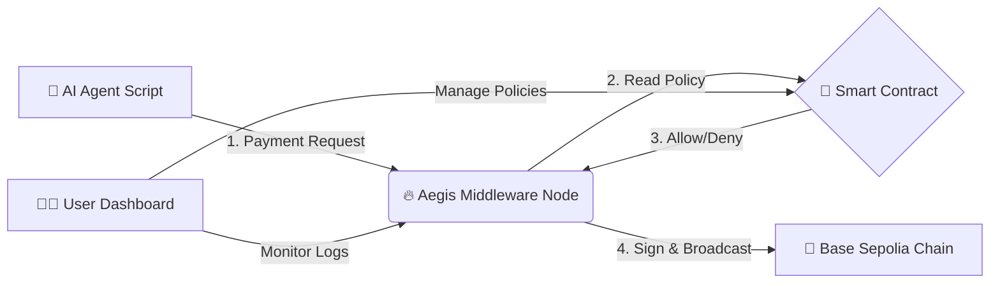

# 🛡️ Aegis Protocol: The AI Economic Firewall

### *“Trust, but Verify.” — A Programmable Firewall & Interception Layer for Autonomous AI Agents*

Autonomous AI Agents are beginning to trade, transact, and operate independently on-chain.
This unlocks enormous potential—**but also enormous risk**.

Aegis is a **middleware economic firewall** that protects users, wallets, and ecosystems from unpredictable AI agent behavior by intercepting, validating, and only approving **policy-compliant blockchain transactions**.

---

## 🚨 The Problem

AI Agents can:

* ❗ Hallucinate malicious or unintended actions
* ❗ Be compromised via prompt-injection
* ❗ Enter infinite loops that drain wallets through gas fees
* ❗ Receive poisoned context that causes bad trades

Today, handing an AI agent a private key is like **giving a toddler a loaded gun**.

---

## ⚡ The Solution: **Aegis**

Aegis introduces an **interception and policy-enforcement layer** between AI Agents and the blockchain.

### ✔️ The Agent never touches the private key

### ✔️ Every transaction must pass an on-chain policy

### ✔️ Aegis will *refuse to sign* any unsafe or unauthorized request

---

## 🌟 Key Features

### 🔐 **Signer Proxy Architecture**

Agents send *intent requests*, not raw transactions.
Aegis validates → signs → broadcasts **only if compliant**.

### 🧱 **Hybrid On-/Off-Chain Security**

* Off-chain: high-speed traffic interception
* On-chain: immutable governance & policy contracts

### 💳 **x402 Compatible**

Designed for **HTTP 402 Payment Required** flows for agent-to-agent commerce.

### 🖥️ **Live "Matrix Mode" Dashboard**

Real-time monitoring of:

* Traffic logs
* Blocked transactions
* Wallet risk metrics

### ⚙️ **Granular Policy Controls**

Define per-agent rules such as:

* “Max 0.1 ETH/day”
* “Only interact with these contracts”
* “No more than 3 tx/minute”

### 🛑 **Emergency Kill Switch**

Freeze an agent **on-chain** instantly.

### 🧪 **Traffic Simulator (Chaos Monkey)**

Generate synthetic malicious or benign agent behavior for demos & testing.

---

## 🏗️ System Architecture



### **Governance Layer (Smart Contract)**

Stores spending limits, allowed contracts, kill switches, and agent rules.

### **Enforcement Layer (Node.js Backend)**

* Holds the private key
* Intercepts all agent actions
* Reads policy via Thirdweb
* Approves or rejects signing

### **Visualization Layer (React Dashboard)**

Human operator view of all agent activity.

---

## 🛠️ Tech Stack

| Layer               | Tools                               |
| ------------------- | ----------------------------------- |
| **Blockchain**      | Avalanche Fuji C-Chain              |
| **Smart Contracts** | Solidity (AegisGuardV2)             |
| **SDK**             | Thirdweb v5                         |
| **Backend**         | Node.js, Express, Ethers v6         |
| **Frontend**        | React, Vite, Tailwind, Lucide Icons |

---

## 🚀 Installation & Setup

### **Prerequisites**

* Node.js 18+
* MetaMask Wallet (with Base Sepolia ETH)
* Thirdweb API Key

---

# 1️⃣ Deploy the Smart Contract

Deploy `AegisGuardV2.sol` via:

* **Thirdweb Deploy**, or
* **Hardhat**

Copy the deployed contract address.

---

# 2️⃣ Backend: Aegis Firewall Node

This backend **holds the private key** and evaluates all agent requests.

```bash
cd backend
npm install
```

Create a `.env` file:

```bash
AGENT_PRIVATE_KEY=your_private_key_here
THIRDWEB_SECRET_KEY=your_secret_key_here
ADMIN_WALLET_ADDRESS=0xYourPublicWallet
CONTRACT_ADDRESS=0xYourContractAddress
```

Start the node:

```bash
node server.js
```

Should output:

```
🔥 Aegis Hybrid Node Running on Port 3001
```

---

# 3️⃣ Frontend: Dashboard

```bash
cd frontend
npm install
```

Create `.env`:

```bash
VITE_CLIENT_ID=your_thirdweb_client_id
VITE_CONTRACT_ADDRESS=0xYourContractAddress
```

Start the UI:

```bash
npm run dev
```

---

## 🧭 Roadmap

* [ ] AI-native multi-agent orchestration
* [ ] zk-proof policy attestations
* [ ] Ethereum mainnet & L2 expansion
* [ ] Plugin ecosystem for custom validators
* [ ] Dedicated Aegis Agent Wallet standard (AEW-01)

---

## 🤝 Contributing

PRs, issues, and feature requests are welcome!

---
## Business Model
### **Pricing Tiers Table**

| Tier | Target Audience | Key Features | Pricing Model |
| :--- | :--- | :--- | :--- |
| **Developer (Freemium)** | Individual Developers, Hobbyists | • Signer Proxy Architecture<br>• Basic Policy Controls (e.g., spending limits)<br>• Support for 1 Agent, up to 100 tx/month | **Free.** Designed to drive adoption, community building, and developer experimentation. |
| **Professional** | Power Users, Small DeFi Teams | • All Developer features<br>• ★ **Advanced Policy Controls** (contract whitelisting, rate limits)<br>• **"Matrix Mode" Dashboard**<br>• Support for up to 5 Agents | **$99/month** + 0.10% per-transaction fee on volume above a set threshold (e.g., $100k/month). |
| **Enterprise** | DeFi Protocols, DAOs, Enterprises | • All Professional features<br>• ★ **Emergency Kill Switch**<br>• **Chaos Monkey Simulator**<br>• Custom On-chain Governance<br>• SLA & Priority Support | **Custom Pricing.** Based on transaction volume, number of agents, and required support/integration services. |

-----

## 🛡️ License

MIT License © 2025 Team Aegis

---
