# 🛡️ Aegis Protocol: The AI Economic Firewall

### *“Trust, but Verify.” — A Programmable Firewall & Interception Layer for Autonomous AI Agents*

Autonomous AI Agents are beginning to trade, transact, and operate independently on-chain.
This unlocks enormous potential—**but also enormous risk**.

Aegis is a **middleware economic firewall** that protects users, wallets, and ecosystems from unpredictable AI agent behavior by intercepting, validating, and only approving **policy-compliant blockchain transactions**.

---

## 🚨 The Problem

AI Agents can:

* ❗ Hallucinate malicious or unintended actions
* ❗ Be compromised via prompt-injection
* ❗ Enter infinite loops that drain wallets through gas fees
* ❗ Receive poisoned context that causes bad trades

Today, handing an AI agent a private key is like **giving a toddler a loaded gun**.

---

## ⚡ The Solution: **Aegis**

Aegis introduces an **interception and policy-enforcement layer** between AI Agents and the blockchain.

##### ✔️ The Agent never touches the private key

##### ✔️ Every transaction must pass an on-chain policy

##### ✔️ Aegis will *refuse to sign* any unsafe or unauthorized request

---

## 🌟 Key Features

### 🔐 **Signer Proxy Architecture**

Agents send *intent requests*, not raw transactions.
Aegis validates → signs → broadcasts **only if compliant**.

### 🧱 **Hybrid On-/Off-Chain Security**

* Off-chain: high-speed traffic interception
* On-chain: immutable governance & policy contracts

### 💳 **x402 Compatible**

Designed for **HTTP 402 Payment Required** flows for agent-to-agent commerce.

### 🖥️ **Live "Matrix Mode" Dashboard**

Real-time monitoring of:

* Traffic logs
* Blocked transactions
* Wallet risk metrics

### ⚙️ **Granular Policy Controls**

Define per-agent rules such as:

* “Max 0.1 ETH/day”
* “Only interact with these contracts”
* “No more than 3 tx/minute”

### 🛑 **Emergency Kill Switch**

Freeze an agent **on-chain** instantly.

### 🧪 **Traffic Simulator (Chaos Monkey)**

Generate synthetic malicious or benign agent behavior for demos & testing.

---

## 🏗️ System Architecture

```mermaid
graph LR
    A[🤖 AI Agent Script] -- 1. Payment Request --> B(🔥 Aegis Middleware Node)
    B -- 2. Read Policy --> C{📜 Smart Contract}
    C -- 3. Allow/Deny --> B
    B -- 4. Sign & Broadcast --> D[🔗 Avalanche Fuji]
    E[👨‍💻 User Dashboard] -- Manage Policies --> C
    E -- Monitor Logs --> B
```



### **Governance Layer (Smart Contract)**

Stores spending limits, allowed contracts, kill switches, and agent rules.

### **Enforcement Layer (Node.js Backend)**

* Holds the private key
* Intercepts all agent actions
* Reads policy via Thirdweb
* Approves or rejects signing

### **Visualization Layer (React Dashboard)**

Human operator view of all agent activity.

---

## 🛠️ Tech Stack

| Layer               | Tools                               |
| ------------------- | ----------------------------------- |
| **Blockchain**      | Avalanche Fuji C-Chain              |
| **Smart Contracts** | Solidity (AegisGuardV2)             |
| **SDK**             | Thirdweb v5                         |
| **Backend**         | Node.js, Express, Ethers v6         |
| **Frontend**        | React, Vite, Tailwind, Lucide Icons |

---

## 🚀 Installation & Setup

### **Prerequisites**

* Node.js 18+
* MetaMask Wallet (with Avalanche Fuji AVAX)
* Thirdweb API Key

---

# 1️⃣ Deploy the Smart Contract

Deploy `AegisGuardV2.sol` via:

* **Thirdweb Deploy**, or
* **Hardhat**

Copy the deployed contract address.

---

# 2️⃣ Backend: Aegis Firewall Node

This backend **holds the private key** and evaluates all agent requests.

```bash
cd backend
npm install
```

Create a `.env` file:

```bash
AGENT_PRIVATE_KEY=
THIRDWEB_SECRET_KEY=
ADMIN_WALLET_ADDRESS=
CONTRACT_ADDRESS=
RPC_URL=              
PORT=
CHAIN=
```

Start the node:

```bash
node server.js
```

Should output:

```
🔥 Aegis Hybrid Node Running on Port 3001
```

---

# 3️⃣ Frontend: Dashboard

```bash
cd frontend
npm install
```

Create `.env`:

```bash
VITE_CLIENT_ID=
VITE_ADMIN_ADDRESS=
VITE_CONTRACT_ADDRESS=
VITE_RPC_URL=
VITE_CHAIN_ID=   
VITE_API_BASE_URL=


```

Start the UI:

```bash
npm run dev
```
---

## 🧭 Roadmap & Future Work

Aegis is designed as a **long-term control plane for autonomous economic agents**. The following features represent the natural evolution of the protocol beyond the MVP.

---

### 🔐 **Account Abstraction (AA) Native Agent Accounts**

Aegis will natively support **ERC-4337 / Account Abstraction wallets** for AI agents.

Instead of traditional EOAs:

* Each AI agent operates via a **smart contract account**
* Aegis becomes a **policy module / validator** in the AA flow
* Transactions are executed only if policy checks pass

**Benefits:**

* No raw private keys at all
* Policy enforcement at the account level
* Native support for session keys, spending caps, and roles
* Gas sponsorship via paymasters for agent workflows

> Aegis evolves from *signer proxy* → *account guardian*.

---

### 🧩 **Pluggable AA Validation Modules**

Support custom AA modules such as:

* Spend-limit validators
* Rate-limit modules
* Contract/domain allowlists
* Time-based execution windows
* AI-behavior-based anomaly detection

Developers will be able to **compose agent security policies like middleware**.

---

### 🔑 **Session Keys & Ephemeral Agent Keys**

Support short-lived, scoped keys for agents:

* “Only valid for 10 minutes”
* “Only allowed to call this API”
* “Only allowed to spend ≤ X ETH”

This allows:

* Safer long-running agents
* Reduced blast radius
* Automatic key rotation for AI workflows

---

### 🤖 **Multi-Agent Hierarchies (Parent–Child Agents)**

Enable advanced agent structures:

* Parent agent controls budget
* Child agents operate under sub-quotas
* Automatic revocation if a child misbehaves

Useful for:

* Agent swarms
* Enterprise AI pipelines
* DAO-owned agent infrastructure

---

### 📜 **Policy-as-Code SDK**

Expose policies as code instead of static configs:

```js
policy.allowIf(ctx =>
  ctx.amount < 0.05 &&
  ctx.target.isWhitelisted &&
  ctx.agent.trustScore > 0.8
);
```

This would allow:

* Dynamic logic
* Conditional rules
* Integration with off-chain signals and ML risk models

---

### 🧠 **Behavioral Risk Scoring**

Future versions of Aegis can integrate:

* Agent activity history
* Pattern detection
* Anomaly scoring

Example:

* Sudden destination changes
* Rapid transaction bursts
* Unusual contract interaction patterns

High-risk behavior can trigger:

* Temporary freezes
* Reduced spending limits
* Human-review mode

---

### 🔒 **Zero-Knowledge Policy Proofs**

Introduce zk-based proofs where:

* A facilitator verifies *“policy was respected”*
* Without revealing the full policy itself

This enables:

* Private enterprise policies
* Public verification
* Compliance-friendly agent payments

---

### 🌐 **Cross-Chain & Cross-Facilitator Enforcement**

Aegis policies will apply across:

* Multiple chains (Ethereum, L2s, Solana-style models)
* Multiple facilitators / relayers

The same agent policy should:

* Follow the agent everywhere
* Be enforceable regardless of settlement layer

---

### 🏛️ **DAO & Enterprise Governance**

Future governance features include:

* Multi-sig control of policies
* DAO votes to update agent limits
* Emergency freezes controlled by governance contracts

This makes Aegis suitable for:

* DAOs running autonomous agents
* Enterprises deploying AI infra at scale

---

## 🔮 Long-Term Vision

> Aegis aims to be the **default economic safety layer for autonomous systems**.

As AI agents become first-class economic actors, Aegis provides:

* Trust without blind delegation
* Autonomy without chaos
* On-chain verifiability without sacrificing flexibility

---

## 🤝 Contributing

PRs, issues, and feature requests are welcome!

---
## Business Model
### **Pricing Tiers Table**

| Tier | Target Audience | Key Features | Pricing Model |
| :--- | :--- | :--- | :--- |
| **Developer (Freemium)** | Individual Developers, Hobbyists | • Signer Proxy Architecture<br>• Basic Policy Controls (e.g., spending limits)<br>• Support for 1 Agent, up to 100 tx/month | **Free.** Designed to drive adoption, community building, and developer experimentation. |
| **Professional** | Power Users, Small DeFi Teams | • All Developer features<br>• ★ **Advanced Policy Controls** (contract whitelisting, rate limits)<br>• **"Matrix Mode" Dashboard**<br>• Support for up to 5 Agents | **$99/month** + 0.10% per-transaction fee on volume above a set threshold (e.g., $100k/month). |
| **Enterprise** | DeFi Protocols, DAOs, Enterprises | • All Professional features<br>• ★ **Emergency Kill Switch**<br>• **Chaos Monkey Simulator**<br>• Custom On-chain Governance<br>• SLA & Priority Support | **Custom Pricing.** Based on transaction volume, number of agents, and required support/integration services. |

-----

## 🛡️ License

MIT License © 2025 Team Aegis

---
